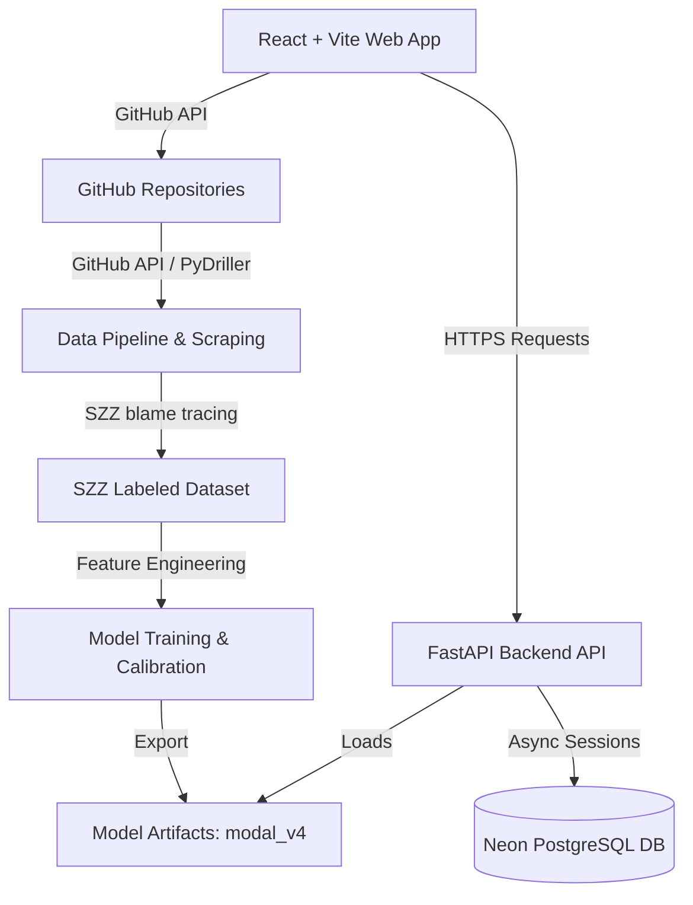

# Bug Prediction System (V4) — System Analysis Report

This report provides a detailed breakdown of your **Bug Prediction System**. It details the architecture, data extraction pipeline (using the SZZ algorithm), the calibrated XGBoost model, backend FastAPI services, React frontend client, and the latest performance metrics.

---

## 1. System Overview & Objective
The core objective of the system is to predict whether a given code commit is likely to introduce a bug. 
- **Target Audience:** Software developers and code reviewers.
- **Goal:** Flag high-risk commits before they are merged into production, preventing defect leakage and minimizing alert fatigue.
- **Repository Context:** Though named `Posture-Detection-Correction-System` in workspace metadata, the active codebase implements a **Git Commit Bug prediction and defect warning system**.

---

## 2. System Architecture

---

## 3. Data Pipeline & Scraping (SZZ Algorithm)
The dataset is built from **16,722 commits** across Python and TypeScript repositories spanning from **2018 to 2026**.

1. **Repository Scoring:** Before scraping a candidate repository, the system tests it to ensure it contains high-quality issue-to-commit links, sorting them as *Excellent*, *Moderate*, or *Poor*.
2. **Identifying Fix Commits:** The pipeline searches closed bug reports (via issue labels like `bug`, `type:bug`) and pulls out the commit SHAs that resolved those issues using PR references and GitHub events.
3. **PyDriller Feature Extraction:** The system clones the repository locally to perform git analysis, extracting 15 primary features per commit (lines added, complexity, files changed, commit time, author history, etc.).
4. **The SZZ Blame Tracing Loop:**
   - For every verified bug-fix commit, the system tracks which lines were modified.
   - It performs a `git blame` on those specific lines *immediately prior* to the fix to identify the parent commit that introduced the bug.
   - It filters out non-bug modifications (e.g. whitespace edits, refactoring, comments).
   - If a commit is successfully identified as the source of a bug, it is labeled with `is_buggy = 1`.
5. **Hybrid Labeling:** Because SZZ alone identifies very few commits (often resulting in extremely severe class imbalances), a keyword fallback triggers for commits with messages like `fixes #` or `closes #` to increase the number of positive training samples.

---

## 4. Machine Learning Model (XGBoost + Calibration)

### Features Engineered (22 Inputs)
The model takes 22 feature columns, grouped into size metrics, code complexity, testing rates, author track record, and temporal context:

| Category | Feature | Description |
| :--- | :--- | :--- |
| **Size** | `lines_added`, `lines_deleted`, `files_changed`, `churn_ratio` | Measures commit volume. |
| **Complexity** | `avg_complexity`, `num_methods`, `complexity_per_file` | Cyclomatic complexity metrics. |
| **Testing** | `test_files_changed`, `test_ratio` | Detects presence/ratio of test edits. |
| **Author Track Record** | `prior_bugs_author` | Rolling history of prior bugs caused by the developer. |
| **Temporal** | `commit_hour`, `day_of_week`, `is_weekend`, `is_night_commit` | Flags when and on what day the work was done. |
| **Categorical** | `language_group`, `time_period` | Tracks language context (Python vs TS) and era. |
| **Interactions** | `night_x_complexity`, `weekend_x_lines`, `size_x_complexity`, `files_x_complexity` | Combines risk indicators (e.g., late-night complex modifications). |

### Addressing Class Imbalance
Bugs are extremely rare in clean repositories—only **5.2%** of commits in your dataset are buggy, and **94.8%** are safe. To prevent the model from simply predicting everything as "Safe" (which would yield 94.8% naive accuracy but 0% bug detection), the XGBoost model is trained with:
* `scale_pos_weight = 18.17`: This instructs the model that missing a real bug is **18 times** worse than accidentally flagging a safe commit.

### Isotonic Probability Calibration
* **The Problem:** Using `scale_pos_weight` makes the model extremely paranoid, causing it to assign exaggeratedly high probabilities (e.g., 90%) to minor risks.
* **The Solution:** An **Isotonic Regressor** is trained on a separate 12% Calibration Pile (independent of the training and testing sets) to adjust the raw output scores back to real-world probabilities. A calibrated probability of 20% means that out of 100 similar commits, exactly 20 will introduce a bug.
* **Optimal Threshold Tuning:** Instead of a default 50% cutoff, the system searches the calibration curve to establish an optimal threshold at **0.240**. Any commit with a calibrated probability of $\geq 0.240$ is flagged as high/medium risk.

---

## 5. Performance Metrics & Evaluation

After eliminating feature leakage (specifically removing the `confidence` column which acted as an accidental cheat sheet in V3, artificially boosting training accuracy to 99.8%), the final model metrics are:

* **Overall Classification Accuracy:** **93.3%**
* **AUC-ROC Score:** **86.35%** (Excellent ability to rank buggy commits above safe ones)
* **PR-AUC (Precision-Recall Area Under Curve):** **36.38%** (The standard metric for class-imbalanced models)
* **Held-Out Test Set Metrics:**
  * **Precision:** **38.97%** — Out of 10 flagged commits, ~4 are true bugs. This is high enough to prevent developer *alert fatigue*.
  * **Recall (Detection Rate):** **47.43%** — The model catches nearly half of all buggy commits before they ever get merged.
  * **F1-Score (Minority Class):** **0.43**
  * **Weighted F1-Score:** **0.94**

---

## 6. Software Architecture

### Backend API (FastAPI)
The backend is structured for easy deployment to Hugging Face Spaces (in Docker container environments) and utilizes:
* **Framework:** FastAPI with Python 3.11.
* **ORM:** SQLAlchemy Async connecting to a **Neon PostgreSQL** database.
* **Authentication:** Password hashing via bcrypt, generating JWT access tokens.
* **Core API Endpoints:**
  * `POST /predict`: Evaluates a single commit's features.
  * `POST /predict/batch`: Batch processes up to 500 commits.
  * `GET /health`: Checks if the FastAPI server and machine learning model loaded successfully.
  * `GET /model/info`: Exposes the model metadata, calibrated threshold, features list, and risk bands.
  * `POST /auth/signup` / `POST /auth/signin` / `GET /auth/me`: Authenticates users.
  * `POST /search/save` / `GET /search/history` / `DELETE /search/history/{id}`: Manages user search history.

### Frontend Web Client (React + Vite)
Built with React, Vite, and styled using Tailwind CSS v4 and Radix UI components:
* **Dashboard Page:** Displays past search history and overall repository statistics.
* **Commit Explorer:** Queries public/private repositories using the GitHub API, parses commits, automatically calculates code metrics, queries author bug track records, and presents them in a detailed risk matrix.
* **Predict Page:** Allows developers to manually input code diff metrics to test hypothetical commits.
* **Model Page:** Details the feature list, performance curves, calibration thresholds, and risk bands.
